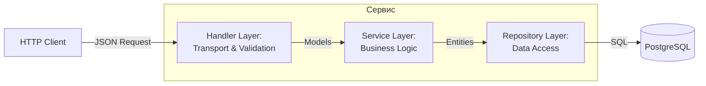
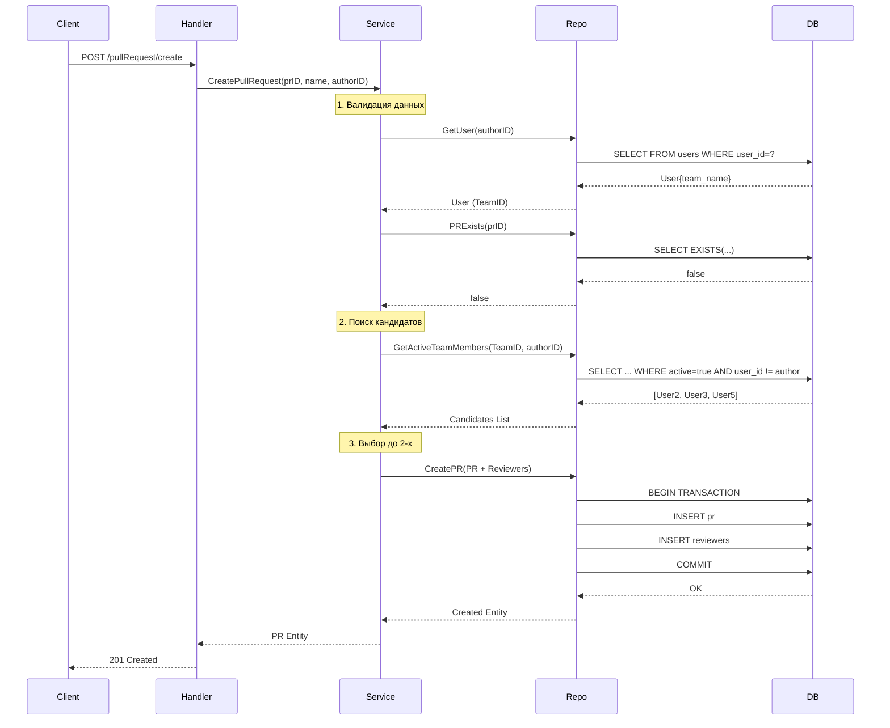
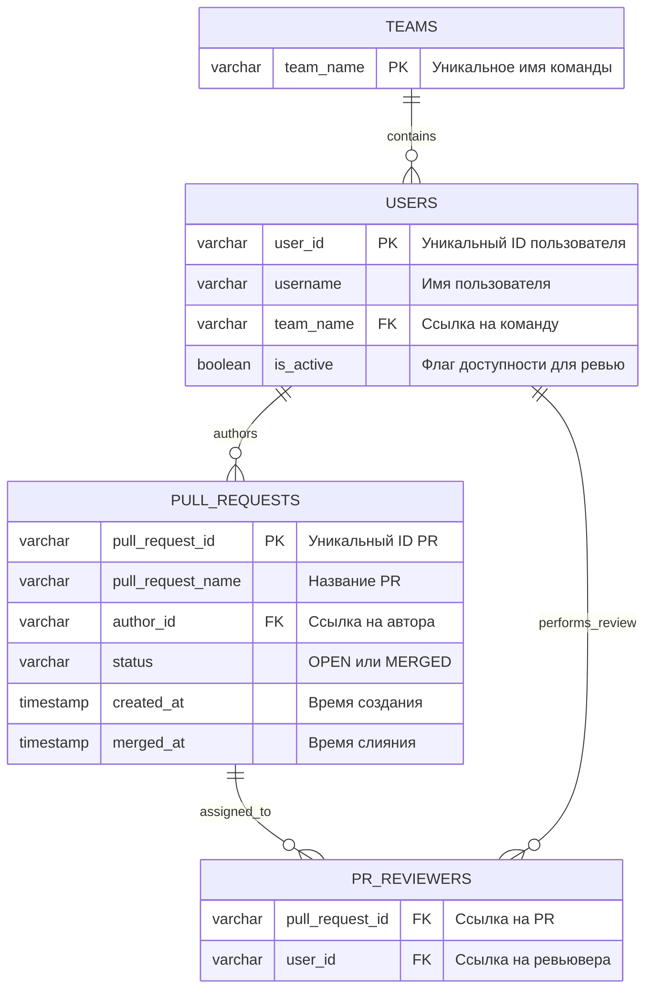
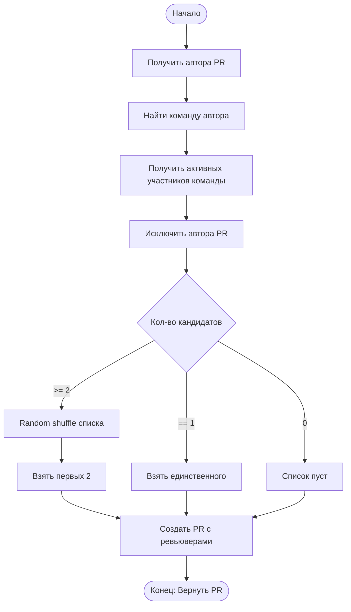
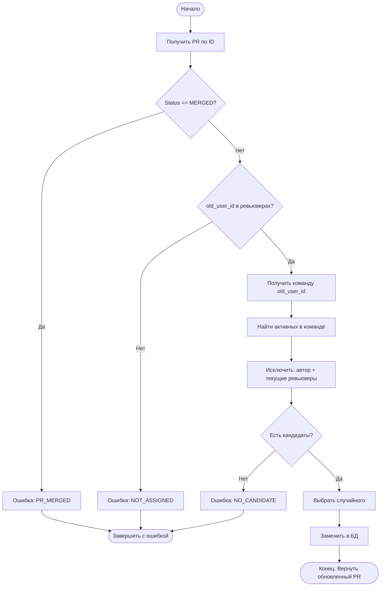
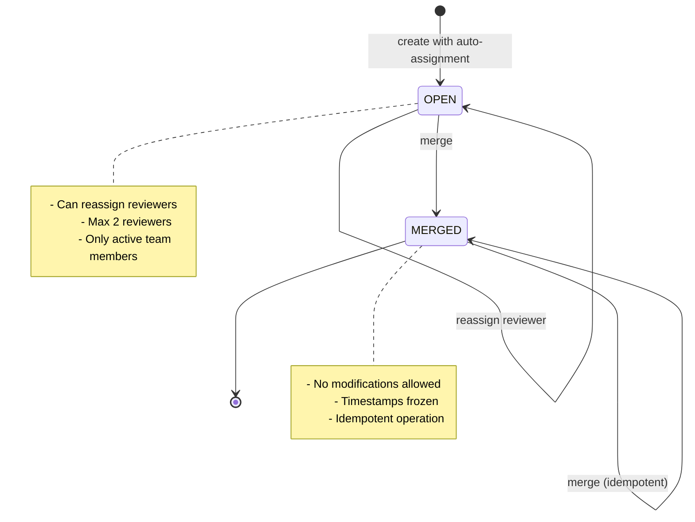

# Сервис назначения ревьюеров (PR Reviewer Assignment Service)

Сервис, который назначает ревьюеров на PR из команды автора, позволяет выполнять переназначение ревьюверов и получать список PR’ов, назначенных конкретному пользователю, а также управлять командами и активностью пользователей.

## Запуск

Сервис и база данных поднимаются через make или docker-compose:

```bash
make up
# или
docker-compose up --build -d
```

Доступ к сервису по адресу:
`http://localhost:8080`

### Основные команды

| Команда | Описание |
|---------|----------|
| `make up` | Сборка и запуск контейнеров |
| `make down` | Остановка контейнеров |
| `make down-v` | Остановка с удалением volumes |
| `make logs` | Просмотр логов |
| `make test` | Запуск интеграционных тестов в изолированной среде |
| `make loadtest` | Запуск нагрузочного тестирования в изолированной среде|
| `make lint` | Проверка кода линтером |
| `make lint-fix` | Автоисправление линтером |

## Принятые решения

### users/getReview без 404
В OpenAPI спецификации для `GET /users/getReview` не описан ответ с кодом 404. `GET /users/getReview` возвращает пустой список если пользователь не найден или не назначен ревьювером.

### Опечатка в openapi.yml
```yml
application/json:
  schema:
    type: object
    required: [ pull_request_id, old_user_id ]
    properties:
      pull_request_id: { type: string }
      old_user_id: { type: string }
  example:
    pull_request_id: pr-1001
    old_reviewer_id: u2   <- old_reviewer_id заменил на old_user_id
```
---

## Дополнительные задания 

Каждый пункт выполнен:

### Эндпоинт статистики (`GET /stats`)
Возвращает:
- Количество команд, пользователей, PR
- Количество открытых/смерженных PR
- Статистика назначений пользователей
- Статистика ревьюверов

### Массовая деактивация (`POST /team/deactivate`)
Метод массовой деактивации пользователей команды

### Конфигурация линтера (`.golangci.yml`)
Конфиг, на основе Golden config:
```yml
  version: "2"

run:
  timeout: 3m
  go: "1.25"

formatters:
  enable:
    - goimports
    - golines

  settings:
    golines:
      max-len: 120

linters:
  enable:
    - asasalint
    - asciicheck
    - bidichk
    - bodyclose
    - canonicalheader
    - copyloopvar
    - cyclop
    - dupl
    - durationcheck
    - embeddedstructfieldcheck
    - errcheck
    - errname
    - errorlint
    - exhaustive
    - exptostd
    - fatcontext
    - forbidigo
    - funcorder
    - funlen
    - gocheckcompilerdirectives
    - gochecknoinits
    - gochecksumtype
    - gocognit
    - goconst
    - gocritic
    - gocyclo
    - godot
    - gomoddirectives
    - goprintffuncname
    - govet
    - iface
    - ineffassign
    - intrange
    - loggercheck
    - makezero
    - mirror
    - mnd
    - musttag
    - nakedret
    - nestif
    - nilerr
    - nilnesserr
    - nilnil
    - noctx
    - nolintlint
    - nonamedreturns
    - nosprintfhostport
    - perfsprint
    - predeclared
    - promlinter
    - protogetter
    - reassign
    - recvcheck
    - rowserrcheck
    - sloglint
    - spancheck
    - sqlclosecheck
    - staticcheck
    - testableexamples
    - testifylint
    - testpackage
    - tparallel
    - unconvert
    - unparam
    - unused
    - usestdlibvars
    - usetesting
    - wastedassign
    - whitespace

linters-settings:
  errcheck:
    check-type-assertions: true
    check-blank: true
  govet:
    check-shadowing: false
  gofmt:
    simplify: true

issues:
  exclude-rules:
    - path: ".*_test\\.go"
      linters:
        - gochecknoinits
        - gocritic
        - mnd
        - gocognit

  exclude-dirs:
    - "loadtest"
    
output:
  formats:
    colored-line-number: {}
  sort-results: true
```

### Интеграционное тестирование (`integration_test/`)
Все endpoints полностью покрыты тестами, проверяется идемпотентность merge

### Результаты нагрузочного тестирования

5000 запросов на операцию, 500 параллельных соединений
| Операция | RPS (запросов/сек) | Средняя задержка (ms) | Success Rate |
|:---|:---:|:---:|:---:|
| Создание PR | ~4461 | 108 ms | 100% |
| Чтение (Get Team) | ~20452 | 23 ms | 100% |
| Статистика | ~505 | 943 ms |  100% |
| Массовая деактивация| - | 14 ms | 100% |

---

## Структура проекта

```
├── cmd/server/main.go           # точка входа, HTTP server
├── internal/
│   ├── apierr/errors.go         # типы ошибок API
│   ├── handlers/handlers.go     # HTTP handlers
│   ├── models/models.go         # модели данных
│   ├── repo/repo.go             # слой БД
│   └── service/service.go       # бизнес-логика
├── migrations/                  # SQL миграции  
├── integration_test/            # интеграционные тесты
├── loadtest/                    # нагрузочное тестирование
├── .golangci.yml                # конфиг линтера
├── docker-compose.yml           # основной сервис (8080)
└── docker-compose.test.yml      # тестовый сервис (8081)
```

---

## Визуализация

## Архитектура системы

Проект реализован по принципам чистой архитектуры:


### Слои приложения

**Handler** (internal/handlers) - Transport Layer
- Парсинг HTTP запросов
- Валидация входных данных
- Маппинг ошибок в HTTP статусы

**Service** (internal/service) - Business Logic
- Бизнес-логика
- Проверка бизнес-правил

**Repository** (internal/repo) - Data Access
- SQL запросы
- Транзакции
- Работа с БД

### Диаграмма последовательности: Создание PR

Логика обработки запроса на создание PR:



---

## Схема базы данных

Используется PostgreSQL:



- **PK** (Primary Key) — первичный ключ, уникальный идентификатор записи
- **FK** (Foreign Key) — внешний ключ, ссылка на запись в другой таблице

- Таблица `pr_reviewers` использует **составной PRIMARY KEY** из `(pull_request_id, user_id)`. Это гарантирует, что один пользователь не может быть назначен на один PR дважды, эти поля также являются внешними ключами

**Индексы:**
- `idx_users_team` на `users(team_name)` — для быстрого поиска участников команды
- PRIMARY KEY constraints автоматически создают индексы на всех ключевых полях

---

## Алгоритмы принятия решений

### Алгоритм назначения:



### Логика замены ревьювера:



### Жизненный цикл PR



---

## Стек технологий

| Компонент | Технология | Версия |
|-----------|------------|--------|
| Язык | Go | 1.25 |
| HTTP Router | chi | v5.0.10 |
| Database | PostgreSQL | 15-alpine |
| DB Driver | pgx/v5 | v5.5.0 |
| Migrations | golang-migrate | v4.16.2 |
| Linter | golangci-lint | 2.6.2 |
| Container | Docker + Docker Compose | - |

---

## Лицензия

MIT